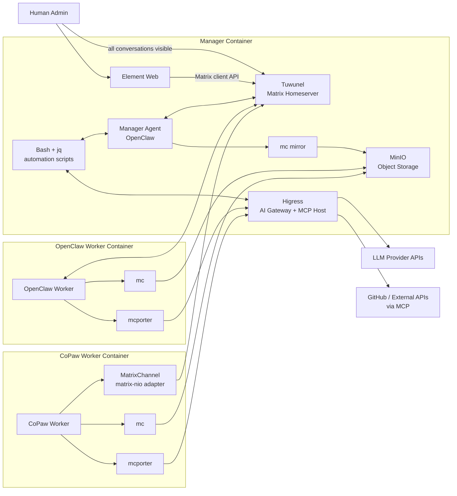
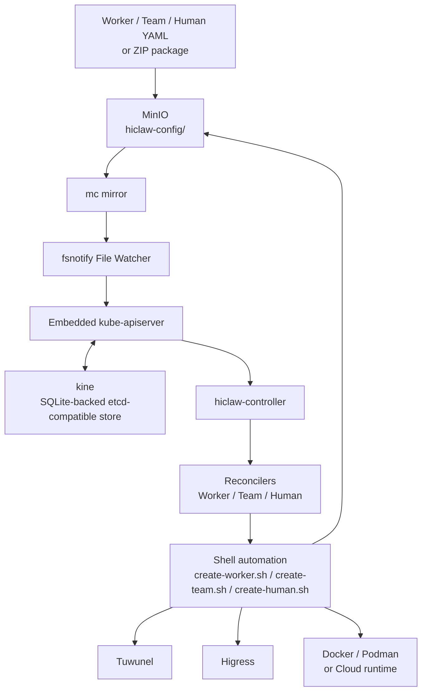

# HiClaw Repository Architecture and Technology Stack

> Research based on the local repository at `/home/ubuntu/code/experiment/hiclaw`.

This note captures the two most useful architecture views for understanding HiClaw:

- The **runtime architecture** used during normal Manager and Worker operation
- The **declarative control plane** used for YAML and ZIP driven reconciliation

## Runtime Architecture

## Declarative Control Plane

## Interpretation

The runtime path is chat-first: humans interact through Matrix, the Manager coordinates Workers, MinIO holds shared state, and Higress gates all LLM and MCP access.

The declarative path is control-plane-first: resource files land in `hiclaw-config`, the embedded controller stack turns them into CRD-style objects, and the same shell scripts reconcile real workers, teams, permissions, and runtime state.
